<!--
  ══════════════════════════════════════════════════════════════
   SOUMIRYA SARANGI — PROFILE README  ·  v4
   Repo: github.com/SoumiryaSarangi/SoumiryaSarangi

   This version uses BESPOKE SVG ASSETS in ./assets/.
   Commit the assets/ folder alongside this file or the hero,
   dividers and project icons will not render.

   Palette:  bg #0D1117 · accent #00D9FF · deep #0A3D62 · #C9D1D9
  ══════════════════════════════════════════════════════════════
-->



<div align="center">

<a href="https://www.linkedin.com/in/soumirya-sarangi-262b38320/"></a>
<a href="mailto:soumiryasarangi@gmail.com"></a>
<a href="https://github.com/SoumiryaSarangi?tab=repositories"></a>


</div>


## `01` &nbsp;·&nbsp; About

```yaml
name:      Soumirya Sarangi
role:      AI/ML Engineer  ·  Full-Stack Developer
education: B.Tech CSE @ Lovely Professional University  ·  CGPA 8.4
domain:    computer vision on satellite SAR imagery
stack:     PyTorch · Python · Next.js · TypeScript
```

I build machine learning systems end to end — the model, the evaluation that decides whether it is any good, and the product surface that puts it in front of a user. Most of my recent work is in remote sensing, on imagery that looks nothing like the natural-image datasets standard architectures are tuned for.


## `02` &nbsp;·&nbsp; Selected work

<table>
<tr>
<td width="50%" valign="top">

###  &nbsp;UDGAM


*SAR sees through cloud and darkness — but renders wind shadows and algal slicks almost identically to oil.*

Detection stage of a maritime oil spill pipeline. I gated a U-Net segmenter behind a CNN scene classifier, trained on 2,570 Sentinel-1 scenes.

**0.942** scene accuracy · **0.757** pooled IoU on a sealed holdout · look-alike rejection **0.08 → 0.84**

<sub>`PyTorch` · `rasterio` · `OpenCV` · `Earth Engine`</sub>

</td>
<td width="50%" valign="top">

###  &nbsp;SenseiAI

<a href="https://exam-prep-ai-ebon.vercel.app"></a>
<a href="https://github.com/SoumiryaSarangi/ExamPrep-AI"></a>


*Study tools demand an account and an API key before the first session — enough friction that most students never reach it.*

Turns lecture PDFs into notes, flashcards, quizzes and timed exams via LLaMA 3.3 70B on Groq. SM-2 spaced repetition and a weak-area tracker that builds practice sets from what you are failing.

Local-first on IndexedDB — demo mode needs no key at all.

<sub>`Next.js 15` · `TypeScript` · `Zustand` · `Dexie`</sub>

</td>
</tr>

<tr>
<td width="50%" valign="top">

###  &nbsp;A.R.T.H.U.R.

<a href="https://github.com/SoumiryaSarangi/A.R.T.H.U.R.-Active-Response-Tether-Heuristic-User-Recognizer"></a>


*Screen locks fire while you are still sitting there, and stay open after you walk away.*

Physical zero-trust workstation guard. MediaPipe face detection establishes presence, Bluetooth proximity confirms it, and a three-state machine escalates between them instead of flipping a boolean.

FastAPI streaming over WebSockets to a Next.js front end.

<sub>`Python` · `FastAPI` · `MediaPipe` · `WebSockets`</sub>

</td>
<td width="50%" valign="top">

###  &nbsp;ML Educational Chatbot

<a href="https://github.com/SoumiryaSarangi/ml-educational-chatbot"></a>


*Conversational Q&A has become synonymous with calling an LLM. For a narrow domain it may not be necessary — but almost nobody checks.*

TF-IDF into a Naive Bayes intent classifier, responses retrieved by cosine similarity over a curated knowledge base, served through Dash.

Millisecond responses on CPU, zero cost per query, every decision traceable to a feature weight.

<sub>`Python` · `scikit-learn` · `Dash`</sub>

</td>
</tr>

<tr>
<td width="50%" valign="top">

###  &nbsp;Fashion-MNIST · HOG + SVM

<a href="https://github.com/SoumiryaSarangi/Image-Classifier-for-fashion-mnist-hog-svm"></a>


*Usually treated as a CNN exercise. The more useful question is how far a hand-built descriptor still gets you.*

HOG descriptors into a linear SVM, each stage swappable, features and models cached so re-runs cost seconds.

**89.2%** test accuracy, no network and no GPU. Per-class evaluation puts nearly all residual error in the shirt/coat/pullover cluster — exactly where texture descriptors should struggle.

<sub>`Python` · `scikit-learn` · `scikit-image`</sub>

</td>
<td width="50%" valign="top">

###  &nbsp;Meat Freshness Analyzer

<a href="https://marbl-app.onrender.com"></a>
<a href="https://github.com/SoumiryaSarangi/Meat-freshness-analyzer"></a>


*Freshness at point of sale is judged by eye, inconsistently, by people with no time to be careful.*

Camera-based classifier that grades a cut for freshness and routes it by physical size. Mobile-first, because the user is standing at a counter.

The deployment constraint drove the modelling — everything had to run fast on a phone browser.

<sub>`Python` · `OpenCV` · `scikit-learn` · `Flask`</sub>

</td>
</tr>
</table>

<sub>Also: an <a href="https://github.com/SoumiryaSarangi/OS-CA-Automated-Deadlock-Detection-Tool">interactive OS deadlock detection tool</a> — matrix-based and Wait-For Graph, visualised step by step.</sub>


## `03` &nbsp;·&nbsp; How I work

<table>
<tr>
<td width="33%" valign="top">

**Baseline first**

A classical method goes in before a network, so there is something to measure the network against.

</td>
<td width="33%" valign="top">

**Honest splits**

Splits at the scene level, thresholds fixed on validation, holdout opened once at the end.

</td>
<td width="33%" valign="top">

**Ship it**

A result in a notebook is not a deliverable. I take projects through to something deployed.

</td>
</tr>
</table>


## `04` &nbsp;·&nbsp; Toolkit

<div align="center">

<sub>**LANGUAGES**</sub>


<sub>**DEEP LEARNING & COMPUTER VISION**</sub>


<sub>**WEB & FULL-STACK**</sub>


<sub>**DATA, INFRASTRUCTURE & TOOLING**</sub>


</div>


## `05` &nbsp;·&nbsp; Activity

<div align="center">


<br /><br />

<picture>
  <source media="(prefers-color-scheme: dark)" srcset="https://raw.githubusercontent.com/SoumiryaSarangi/SoumiryaSarangi/output/github-contribution-grid-snake-dark.svg" />
  <source media="(prefers-color-scheme: light)" srcset="https://raw.githubusercontent.com/SoumiryaSarangi/SoumiryaSarangi/output/github-contribution-grid-snake.svg" />
  
</picture>

</div>

<!--
  ┌──────────────────────────────────────────────────────────────┐
  │  SELF-HOSTED STATS — uncomment after deploying your own      │
  │  instance. These cards need a GitHub token, which is why     │
  │  the shared public instances keep failing.                   │
  │                                                              │
  │  1. Fork  github.com/anuraghazra/github-readme-stats         │
  │  2. Import the fork on vercel.com, accept all defaults       │
  │  3. Add env var  PAT_1 = a classic token, public_repo scope  │
  │  4. Replace YOUR-INSTANCE with your new Vercel domain        │
  │  5. Delete the two comment markers around this block         │
  └──────────────────────────────────────────────────────────────┘

<div align="center">


</div>

-->


## `06` &nbsp;·&nbsp; Contact

<div align="center">

**Open to internships and research collaborations in computer vision, remote sensing, and applied machine learning.**

<br />

<a href="https://www.linkedin.com/in/soumirya-sarangi-262b38320/"></a>
<a href="mailto:soumiryasarangi@gmail.com"></a>

</div>


